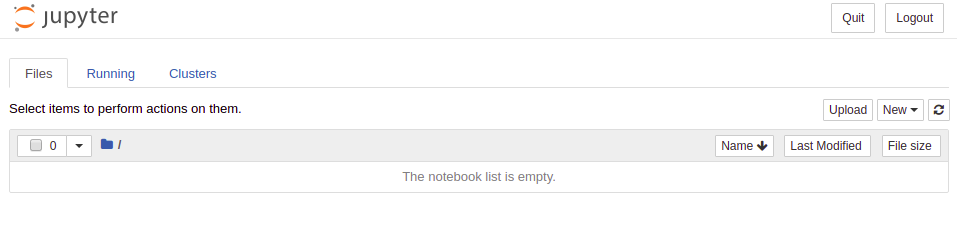

# WorCAP 2019 - Hackathon - Introdução à Data Science

 **Evento**: [WORCAP 2019](http://www.inpe.br/worcap/2019/)  
 **Data**: 19/09/2019  
 **Horário**: 09:00 - 17:30  
 **Local**: LIT  
 **Instrutor**: Rafael Santos (INPE)  

 **Colaboradores do hackathon:**  
 
 - Olga Bittencourt (bolsista PCI - INPE)
 - Felipe Medeiros (mestrando - CAP)
 - Gilberto Queiroz (docente da CAP - INPE)
 - Leonardo de Souza Vieira (doutorando - CAP)
 - Márcia Beatriz Pereira Domingues (bolsista PCI - INPE)
 - Vitor Conrado Faria Gomes (doutorando - CAP)

# 1. Preparação do Ambiente Jupyter

Para a realização das atividades práticas do hackathon é **necessário** que o participante leve um notebook com o ambiente [Anaconda](https://www.anaconda.com/distribution/) previamente instalado.
A seguir estão os links diretos para download do Anaconda para cada Sistema Operacional:

 - [Linux](https://repo.anaconda.com/archive/Anaconda3-2019.07-Linux-x86_64.sh)
 - [Windows 64-Bit](https://repo.anaconda.com/archive/Anaconda3-2019.07-Windows-x86_64.exe)
 - [Windows 32-Bit](https://repo.anaconda.com/archive/Anaconda3-2019.07-Windows-x86.exe)
 - [macOS](https://repo.anaconda.com/archive/Anaconda3-2019.07-MacOSX-x86_64.pkg)

Veja os detalhes sobre a instalação na [documentação oficial](https://docs.anaconda.com/anaconda/install/) do Anaconda.


# 2. Criando Ambiente Conda e instalando pacotes

Se você estiver usando o Windows, abra o **Anaconda Prompt**, no Linux ou macOS abra o **terminal**.

Execute o seguinte comando para criar um ambiente conda hackathon:

```bash
conda create --name hackathon python=3.7
```

Ative o ambiente com o seguinte comando:
```bash
conda activate hackathon
```

Execute o comando abaixo para instalar os pacotes que serão utilizados no hackathon:
```bash
conda install jupyter numpy pandas geopandas seaborn matplotlib psycopg2
pip install wtss
```

Registre esse ambiente para ser utilizado no jupyter notebook
```bash
python -m ipykernel install --user --name hackathon --display-name "Python (hackathon)"
```

Verifique se o jupyter notebook está corretamente instalado rodando:
```bash
jupyter notebook
```
Abra o endereço indicado no log do comando acima. Você deverá ver uma página semelhante à figura abaixo. 




# 3. Download Dados

Inicialmente faça a cópia desse repositório para seu computador. Você pode fazer isso usando o git:

```bash
git clone https://github.com/gqueiroz/worcap-hackathon.git
```

ou fazendo download [nesse link](https://github.com/gqueiroz/worcap-hackathon/archive/master.zip).

Em seguida, baixe os seguintes arquivos para o hackathon:

  - [Malha Municipal 2017 - Fonte: IBGE](http://servicodados.ibge.gov.br/Download/Download.ashx?u=geoftp.ibge.gov.br/organizacao_do_territorio/malhas_territoriais/malhas_municipais/municipio_2017/Brasil/BR/br_municipios.zip)  

  - [Malha UF 2017 - Fonte: IBGE](http://servicodados.ibge.gov.br/Download/Download.ashx?u=geoftp.ibge.gov.br/organizacao_do_territorio/malhas_territoriais/malhas_municipais/municipio_2017/Brasil/BR/br_unidades_da_federacao.zip)  

  - [Focos de Queimada 2017 - Fonte Original: INPE](https://github.com/gqueiroz/cap394/blob/master/2018/class-02/dados/focos_2017.zip)  

 (**Obs.:** Dados Modificados para finalidade da Aula)

